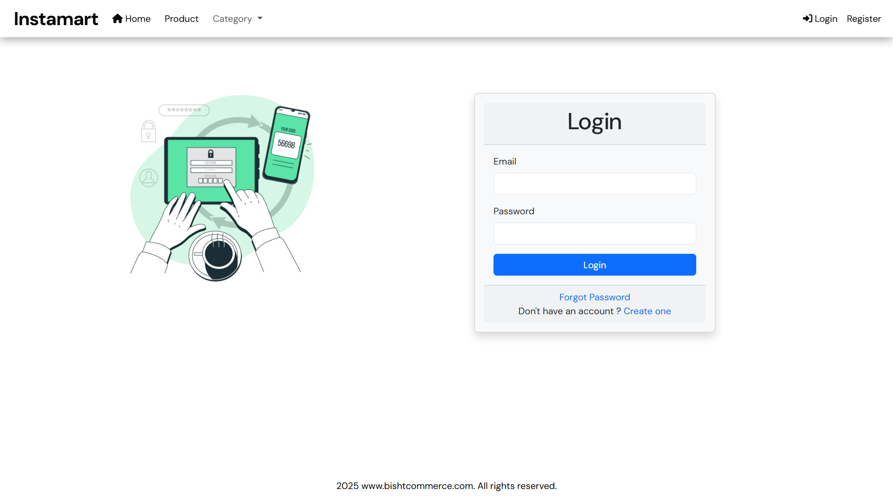
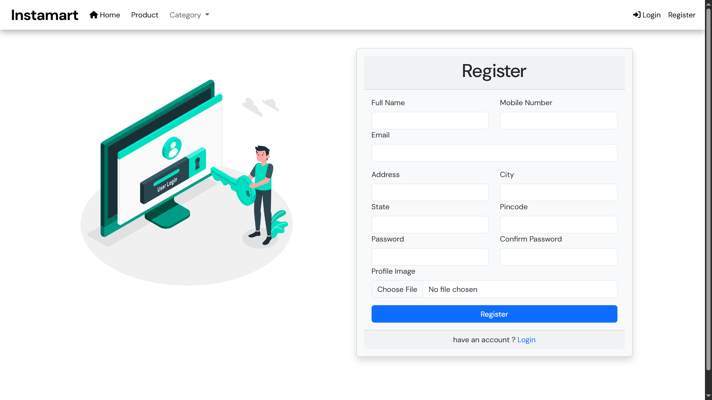

# 🛒 Instamart - E-Commerce Platform

Instamart is a fully functional e-commerce platform built using **Java Spring Boot**, **Spring Security**, and **Thymeleaf**. This project supports essential e-commerce features such as user registration, login, password recovery, product and category management, and an admin dashboard.

---

## 📸 Screenshots

### 🏒 Homepage with Categories


### 🔐 Login Page



### 📝 Register Page




---

## ⚙️ Technologies Used

* **Java 17**
* **Spring Boot**
* **Spring Security**
* **Thymeleaf**
* **Spring MVC**
* **MySQL**
* **Lombok**
* **Bootstrap 5**
* **HTML/CSS/JS**

---

## 🔐 Features

### 👤 User Module

* Register with Full Name, Email, Mobile, Address, etc.
* Login with email/password
* Forgot password (reset via email/OTP – optional)
* Profile image upload

### 📦 Product Management

* Add/Update/Delete product
* Browse products by category
* Product listing with details

### 🧽 Admin Panel

* Dashboard with quick stats
* Add/Edit/Delete categories
* Add/Edit/Delete products
* Manage users

### 🔒 Security

* Password encryption using BCrypt
* Session management and role-based access
* Spring Security integration

---

## 🏗️ Folder Structure

```
instamart/
├── src/main/java/com/instamart
│   ├── controller/
│   ├── model/
│   ├── repository/
│   ├── service/
│   └── InstamartApplication.java
├── src/main/resources
│   ├── templates/     # Thymeleaf templates
│   ├── static/        # CSS, JS, Images
│   └── application.properties
└── pom.xml
```

---

## ▶️ How to Run

1. **Clone the repository**

   ```bash
   git clone https://github.com/your-username/instamart.git
   cd instamart
   ```

2. **Configure MySQL DB**

   Update `application.properties`:

   ```properties
   spring.datasource.url=jdbc:mysql://localhost:3306/instamart_db
   spring.datasource.username=root
   spring.datasource.password=yourpassword
   ```

3. **Run the project**

   ```bash
   mvn spring-boot:run
   ```

4. **Visit in browser**

   ```
   http://localhost:8080
   ```

---

## ✅ Future Enhancements

* Payment gateway integration
* Cart and order management
* Wishlist and user reviews
* Email verification with OTP
* Responsive UI improvements

---

## 👨‍💻 Author

**Prakash Bisht**
[LinkedIn](https://www.linkedin.com/theprakashbisht) | [Email](mailto:theprakashbisht@gmail.com)
